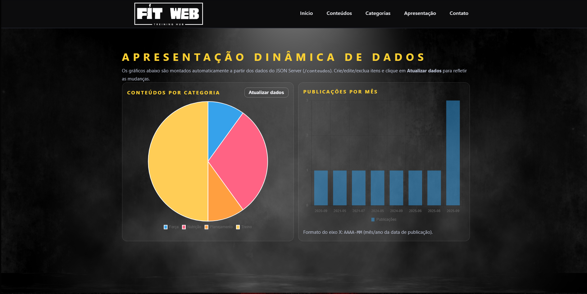
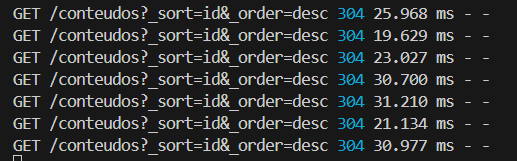

# Trabalho Prático 07 - Semanas 13 e 14

A partir dos dados cadastrados na etapa anterior, vamos trabalhar formas de apresentação que representem de forma clara e interativa as informações do seu projeto. Você poderá usar gráficos (barra, linha, pizza), mapas, calendários ou outras formas de visualização. Seu desafio é entregar uma página Web que organize, processe e exiba os dados de forma compreensível e esteticamente agradável.

Com base nos tipos de projetos escohidos, você deve propor **visualizações que estimulem a interpretação, agrupamento e exibição criativa dos dados**, trabalhando tanto a lógica quanto o design da aplicação.

Sugerimos o uso das seguintes ferramentas acessíveis: [FullCalendar](https://fullcalendar.io/), [Chart.js](https://www.chartjs.org/), [Mapbox](https://docs.mapbox.com/api/), para citar algumas.

## Informações do trabalho

- Nome: Arthur Emmanuel Oliveira Marinho
- Matricula: 900544
- Proposta de projeto escolhida: Proposta: Temas e Conteúdos Associados - Entidade Principal: Tema: Fitness, Musculação - Entidade Secundária: Conteúdos/Recursos: Dicas e video-aulas incorporadas do Youtube sobre treino e dieta. - Exemplos Temáticos: Vídeos, cursos, posts, categorias e dicas.
- Breve descrição sobre seu projeto: Fit Web – Training Hub é um site pessoal que reúne conteúdos de musculação (vídeo-aulas e artigos) para estudo e motivação. A página inicial traz uma chamada clara — “Seja seu melhor” — com botão de ação, seguida de Posts em Destaque, Lista de Posts e Categorias (Força, Hipertrofia, Mobilidade, Nutrição e Planejamento), facilitando o acesso rápido ao que o usuário procura. O visual usa tema escuro com destaques em amarelo e vermelho, reforçando energia e contraste, e cartões leves que priorizam títulos e imagens. Há pequenos efeitos de interação (hover) para dar feedback ao usuário e uma citação motivacional que encerra a página. O layout é responsivo, com navegação simples e tipografia legível, visando oferecer uma experiência direta, agradável e motivadora.

**Print da tela com a implementação**

Nesta etapa foi criada a página analises.html para apresentar os dados do projeto de forma visual e interativa usando Chart.js (via CDN). Os gráficos são alimentados diretamente pela API do JSON Server (/conteudos) através do app.js, reutilizando o mesmo fluxo do CRUD já existente.

